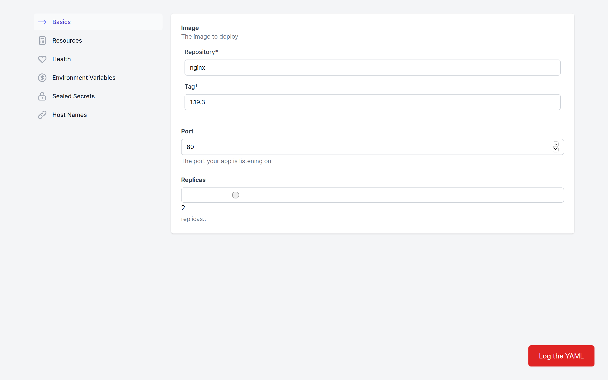

# Project to demonstrate Helm React UI

Test application for https://github.com/gimlet-io/helm-react-ui

Using https://github.com/rjsf-team/react-jsonschema-form to generate the form.

See the https://github.com/gimlet-io/helm-react-ui-test-bed/tree/main/fixtures/onechart fixture to see how the following UI is generated.

